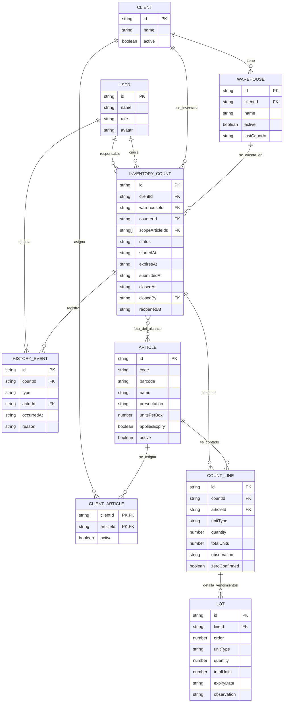

# Modelo de datos del prototipo Inventario Nara

## Resumen en terminos simples

El prototipo guarda la informacion en el navegador, no en una base de datos real. El modelo representa las piezas que la aplicacion necesita para simular un levantamiento de inventario: usuarios, clientes, bodegas, articulos, asignaciones, conteos, lotes e historial.

La idea central es esta:

- Un cliente puede tener varias bodegas.
- Un cliente tiene articulos asignados.
- Un levantamiento se hace para un cliente y una bodega.
- Cada levantamiento tiene lineas de conteo, una por articulo contado.
- Si un articulo maneja vencimiento, su linea puede dividirse en lotes.
- Cada cambio importante queda registrado en el historial.

## Entidades principales

### Usuario

Representa a la persona que usa el prototipo.

Campos:

- `id`: identificador unico.
- `name`: nombre del usuario.
- `role`: rol del usuario. Puede ser `Contador` o `Supervisor`.
- `avatar`: iniciales o texto corto para mostrar en pantalla.

Uso:

- El contador crea y registra levantamientos.
- El supervisor revisa, cierra, reabre y administra catalogos.

### Cliente

Representa la empresa o negocio donde se realiza el inventario.

Campos:

- `id`: identificador unico.
- `name`: nombre del cliente.
- `active`: indica si el cliente esta disponible para nuevos levantamientos.

Uso:

- Solo los clientes activos aparecen al crear un nuevo levantamiento.
- Los clientes inactivos conservan historial, pero no se usan para nuevos conteos.

### Bodega

Representa una ubicacion fisica de inventario dentro de un cliente.

Campos:

- `id`: identificador unico.
- `clientId`: referencia al cliente propietario.
- `name`: nombre de la bodega.
- `active`: indica si la bodega esta disponible.
- `lastCountAt`: fecha opcional del ultimo levantamiento mostrado en pantalla.

Uso:

- Una bodega siempre pertenece a un cliente.
- Solo las bodegas activas del cliente seleccionado aparecen en Nuevo levantamiento.

### Articulo

Representa un producto del catalogo.

Campos:

- `id`: identificador unico.
- `code`: codigo interno del articulo.
- `barcode`: codigo de barras opcional.
- `name`: nombre del articulo.
- `presentation`: presentacion. Puede ser `Caja` o `Unidad`.
- `unitsPerBox`: cantidad de unidades por caja.
- `appliesExpiry`: indica si requiere fecha de vencimiento.
- `active`: indica si esta activo en el catalogo.

Uso:

- Los articulos activos pueden asignarse a clientes.
- Si `appliesExpiry` es verdadero, el conteo debe incluir vencimiento o lotes.

### Asignacion cliente-articulo

Representa que un articulo aplica para un cliente.

Campos:

- `clientId`: referencia al cliente.
- `articleId`: referencia al articulo.
- `active`: indica si la relacion esta activa.

Clave:

- La clave logica es compuesta: `clientId + articleId`.

Uso:

- Define el surtido de articulos de cada cliente.
- Al iniciar un levantamiento se toma una foto de las asignaciones activas.

### Levantamiento de inventario

Representa un conteo de inventario para un cliente y una bodega.

Campos:

- `id`: identificador unico.
- `clientId`: cliente inventariado.
- `warehouseId`: bodega inventariada.
- `counterId`: usuario contador responsable.
- `scopeArticleIds`: lista de articulos que forman el alcance del levantamiento.
- `status`: estado del levantamiento.
- `startedAt`: fecha de inicio.
- `expiresAt`: fecha en que vence el borrador.
- `submittedAt`: fecha opcional de envio a revision.
- `closedAt`: fecha opcional de cierre.
- `closedBy`: usuario supervisor que cerro.
- `reopenedAt`: fecha opcional de reapertura.

Uso:

- Es la entidad principal del flujo.
- Guarda la foto del alcance para que cambios posteriores del catalogo no alteren el conteo ya iniciado.

### Linea de conteo

Representa la cantidad registrada para un articulo dentro de un levantamiento.

Campos:

- `id`: identificador unico.
- `countId`: referencia al levantamiento.
- `articleId`: referencia al articulo contado.
- `unitType`: unidad usada en el conteo. Puede ser `Caja` o `Unidad`.
- `quantity`: cantidad capturada.
- `totalUnits`: total convertido a unidades.
- `observation`: observacion opcional.
- `zeroConfirmed`: indica si el supervisor confirmo cantidad cero.

Uso:

- Una linea resuelve un articulo dentro del levantamiento.
- El progreso se calcula comparando las lineas contra `scopeArticleIds`.

### Lote

Representa detalle por vencimiento para articulos que lo requieren.

Campos:

- `id`: identificador unico.
- `lineId`: referencia a la linea de conteo.
- `order`: numero visible del lote.
- `unitType`: unidad usada en el lote.
- `quantity`: cantidad del lote.
- `totalUnits`: total del lote convertido a unidades.
- `expiryDate`: fecha de vencimiento.
- `observation`: observacion opcional.

Uso:

- Un articulo con vencimiento puede tener uno o varios lotes.
- El total de la linea se calcula sumando los lotes.

### Evento de historial

Representa una accion importante ocurrida en el levantamiento.

Campos:

- `id`: identificador unico.
- `countId`: referencia al levantamiento.
- `type`: tipo de evento.
- `actorId`: usuario que ejecuto la accion.
- `occurredAt`: fecha del evento.
- `reason`: motivo opcional.

Eventos usados:

- `Creado`
- `Enviado a revision`
- `Cerrado`
- `Reabierto`
- `Reactivado`

Uso:

- Permite saber quien hizo cada cambio importante y cuando.
- La reapertura exige motivo.

## Estados del levantamiento

### Borrador

Estado inicial. El contador puede registrar cantidades, editar conteos y guardar avances.

Reglas:

- Dura 24 horas desde su inicio o desde una reactivacion.
- No se puede crear otro borrador vigente para el mismo cliente y bodega.

### Borrador vencido

No es un estado guardado aparte; es una condicion calculada cuando la fecha actual de demostracion supera `expiresAt`.

Reglas:

- El conteo queda bloqueado.
- El supervisor puede habilitarlo por 24 horas.

### En revision

Estado en que el supervisor revisa cobertura y pendientes.

Reglas:

- Se muestran los articulos del alcance que todavia no tienen linea de conteo.
- El supervisor puede registrar conteo o confirmar cantidad cero.
- No se puede cerrar mientras existan pendientes.

### Cerrado

Estado final de consulta.

Reglas:

- El levantamiento queda de solo lectura.
- Solo un supervisor puede reabrirlo.
- Reabrir exige motivo y regresa el levantamiento a `En revision`.

## Reglas de acceso

### Contador

Puede:

- Ver levantamientos.
- Crear nuevo levantamiento.
- Retomar borradores vigentes.
- Buscar o escanear articulos.
- Guardar conteos.
- Enviar a revision.
- Consultar catalogo en solo lectura.

No puede:

- Administrar catalogo.
- Administrar clientes o bodegas.
- Cerrar levantamientos.
- Reabrir levantamientos cerrados.

### Supervisor

Puede:

- Ver levantamientos.
- Revisar cobertura.
- Registrar conteos pendientes.
- Confirmar cantidad cero.
- Cerrar levantamientos completos.
- Reabrir levantamientos cerrados con motivo.
- Habilitar borradores vencidos.
- Crear y editar articulos.
- Crear y editar clientes.
- Crear y editar bodegas.
- Gestionar articulos asignados a clientes.

Importante:

- Estas reglas se implementan con Supabase Auth, perfiles vinculados en `public.app_users` y politicas RLS versionadas en `supabase/migrations/`. La interfaz sigue mostrando estados y permisos, pero la fuente de verdad de autorizacion es la base de datos.

## Formularios y acciones relacionados con el modelo

### Nuevo levantamiento

Entidades afectadas:

- `InventoryCount`
- `HistoryEvent`

Acciones:

- Seleccionar cliente.
- Seleccionar bodega.
- Crear levantamiento.

Reglas:

- Cliente y bodega son obligatorios.
- La bodega depende del cliente seleccionado.
- El alcance se captura desde las asignaciones activas del cliente.
- Se crea evento `Creado`.

### Conteo de inventario

Entidades afectadas:

- `CountLine`
- `InventoryCount`
- `HistoryEvent`

Acciones:

- Buscar articulo.
- Escanear o ingresar codigo manual.
- Capturar cantidad.
- Guardar conteo.
- Enviar a revision.
- Habilitar borrador vencido, si el usuario es supervisor.

Reglas:

- La cantidad debe ser entero entre 0 y 999999.
- Si se cuenta por caja, se multiplica por `unitsPerBox`.
- Si el articulo vence, se requiere fecha o lote.
- Enviar a revision crea evento `Enviado a revision`.
- Habilitar borrador vencido actualiza `expiresAt` y crea evento `Reactivado`.

### Lotes y vencimientos

Entidades afectadas:

- `Lot`
- `CountLine`

Acciones:

- Agregar lote.
- Editar lote.
- Eliminar lote.
- Guardar lotes.

Reglas:

- Cada lote requiere cantidad y fecha.
- El total de la linea se recalcula desde los lotes.

### Revision de cobertura

Entidades afectadas:

- `CountLine`
- `InventoryCount`
- `HistoryEvent`

Acciones:

- Registrar conteo pendiente.
- Confirmar cantidad cero.
- Cerrar levantamiento.

Reglas:

- Los pendientes salen de comparar `scopeArticleIds` contra las lineas existentes.
- Confirmar cero crea una linea con `zeroConfirmed = true`.
- Cerrar registra `closedAt`, `closedBy` y evento `Cerrado`.

### Levantamiento cerrado

Entidades afectadas:

- `InventoryCount`
- `HistoryEvent`

Acciones:

- Consultar resumen.
- Consultar historial.
- Reabrir levantamiento.

Reglas:

- Reabrir solo esta disponible para supervisor.
- Reabrir exige motivo.
- Reabrir crea evento `Reabierto` y cambia el estado a `En revision`.

### Catalogo

Entidades afectadas:

- `Article`

Acciones:

- Crear articulo.
- Editar articulo.
- Filtrar por activos, inactivos o todos.

Reglas:

- Nombre y codigo son obligatorios.
- El codigo debe ser unico.
- `unitsPerBox` debe estar entre 1 y 9999.

### Clientes y bodegas

Entidades afectadas:

- `Client`
- `Warehouse`
- `ClientArticle`

Acciones:

- Crear o editar cliente.
- Crear o editar bodega.
- Gestionar articulos asignados.

Reglas:

- El nombre de cliente debe ser unico.
- El nombre de bodega debe ser unico dentro del cliente.
- Las asignaciones afectan levantamientos futuros, no levantamientos ya iniciados.

### Perfil

Entidades afectadas:

- `AppState`

Acciones:

- Cambiar rol de demostracion.
- Avanzar o restaurar reloj.
- Restablecer datos.

Reglas:

- Cambiar rol solo modifica acciones visibles.
- Restablecer datos vuelve al escenario inicial.

## ERD en Mermaid

## Supuestos materiales

- `ClientArticle` no tiene `id`; se trata como clave compuesta por `clientId + articleId`.
- `scopeArticleIds` es una lista dentro de `InventoryCount`, pero conceptualmente funciona como una relacion entre levantamiento y articulos.
- Las fechas se guardan como texto ISO.
- `HistoryEvent.type` es texto libre en el prototipo; en una version productiva convendria convertirlo en catalogo controlado.
- `lastCountAt` ayuda a mostrar contexto, pero no reemplaza el historial transaccional.
- Las reglas de acceso son de demostracion y dependen de la interfaz.
